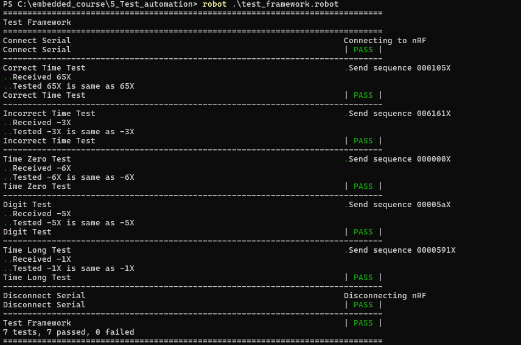

##5. Test Automation  
  
#Toteutettu kahteen pisteen vaatimuksiin tarvittavat asiat: 

Tarkistetaan annettua aikajonoa eri testikeisseillä:  
    - Oikea merkkijono  
    - Väärä merkkijono  
    - Liian pitkä merkkijono  
    - Merkkijonossa nollia  
    - Merkkijonossa muuta kuin numeroita (IsDigit)  
    

